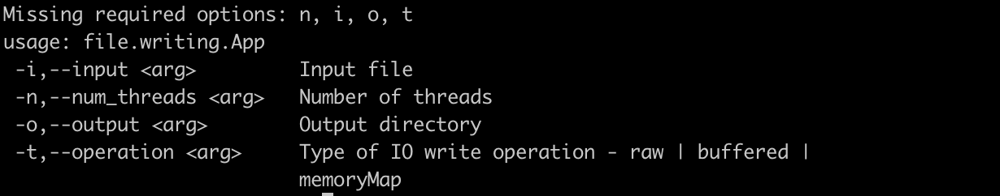
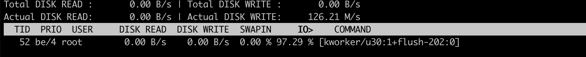

### Intent

The intent of this app is to test the file writing throughput in an EC2 instance. Create an EC2 instance with the following types of volumes mounted:
* GP3 Volume
* IO2 volume
* EFS (https://docs.aws.amazon.com/AWSEC2/latest/UserGuide/AmazonEFS.html)

### Building

* Make sure java and gradle are installed locally
* Run command `gradle shadowjar`
* This will generate the jar we need : `./app/build/libs/app-all.jar`
* Run the app with the following options

Example run command: 

`java  -jar /tmp/app-all.jar -i /tmp/file.txt -n 5 -o /tmp/ -t buffered`

### Changes in instance 

* First create a 1 GB file by running following command
  * `dd if=/dev/zero of=/tmp/file.txt count=1024 bs=1048576`
* Install jdk on the EC2 instance
  * `wget --no-check-certificate -c --header "Cookie: oraclelicense=accept-securebackup-cookie" https://download.oracle.com/java/17/latest/jdk-17_linux-x64_bin.rpm`
  * `sudo rpm -Uvh jdk-17_linux-x64_bin.rpm`
* Run the app
  * `java  -jar /tmp/app-all.jar -i /tmp/file.txt -n 5 -o /tmp/ -t buffered`
* Run this with dofferent output locations based on which type of volume we are testing the write throughput for

### Monitoring the IO 

* Run the following commands
  * `iotop -o`
  * `watch iostat -hxym` 

These two commands will indicate what is happening under the covers. iotop command will give an output like below which will indicate the write throughput we are getting.

As we see in this image the kernel is busy flushing from disk cache to disk. `Actual Disk Write` indicates the actual disk write throughput

